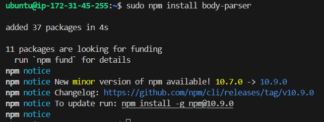
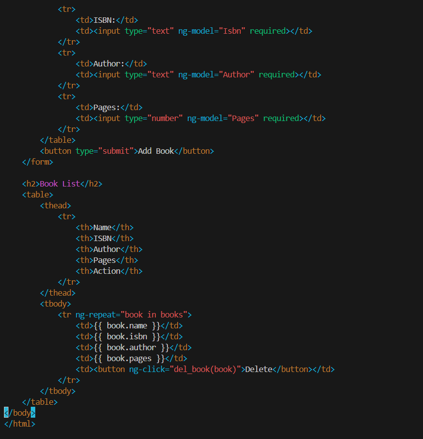

# MEAN Stack Deployment to Ubuntu in AWS

## What is MEAN Stack?

MEAN stack is a set of JavaScript-based technologies used for building full-stack web applications. MEAN stands for MongoDB, Express.js, Angular, and Node.js. Each component of the MEAN stack plays a specific role in the development process, allowing developers to create robust, scalable, and fast applications.

MEAN Stack is a combination of following components:

1. MongoDB (Document database) - Stores and allows to retrieve data.
2. Express (Back-end application framework) - Makes requests to Database for Reads and
   Writes.
3. Angular (Front-end application framework) - Handles Client and Server Requests
4. Node.js (JavaScript runtime environment) - Accepts requests and displays results to end user

## MEAN Stack Workflow Example:

1. Client-Side (Angular): Angular captures user input and sends HTTP requests.
2. Server-Side (Express & Node): Node.js receives requests, and Express processes them, querying or updating the MongoDB database.
3. Database (MongoDB): MongoDB stores and retrieves data as needed, responding to the server.

**Note:** MEAN stack is widely used for building modern web applications, such as social media platforms, e-commerce sites, and real-time messaging apps.

## Steps Involved:

- **Step 0:** Preparing Prerequisite. Creating an AWS account and a virtual server with Ubuntu Server OS.
- **Step 1:** Install Node.js

## Step 0: Preparing Prerequisite.

Create an AWS account and a virtual server with Ubuntu Server OS.
The same process used during the LEMP project was used here.

## Step 1: Install Node.js

1.  **update and upgrade Ubuntu**

    sudo apt update

    sudo apt upgrade

2.  **Add certificates**

        sudo apt -y install curl dirmngr apt-transport-https lsb-release ca-certificates

        curl -sL https://deb.nodesource.com/setup_18.x | sudo -E bash -

3.  **Install Node.js**

        sudo apt install -y nodejs

## Step 2: Install MongoDB

MongoDB stores data in flexible, JSON-like documents. Fields in a database can vary from
document to document and data structure can be changed over time. For our example
application, we are adding book records to MongoDB that contain book name, isbn number,
author, and number of pages.

        sudo apt-get install -y gnupg curl

        curl -fsSL https://www.mongodb.org/static/pgp/server-7.0.asc | sudo gpg --dearmor -o /usr/share/keyrings/mongodb-server-7.0.gpg

This command _curl -fsSL https://www.mongodb.org/static/pgp/server-7.0.asc | sudo gpg --dearmor -o /usr/share/keyrings/mongodb-server-7.0.gpg_ downloads MongoDB’s public GPG key, which is used to verify the authenticity of the MongoDB packages before they are installed

## Verify the key is downloaded

To verify that the key was downloaded and saved correctly, you can use the following command

        ls -l /usr/share/keyrings/mongodb-server-7.0.gpg

        echo "deb [ arch=amd64,arm64 signed-by=/usr/share/keyrings/mongodb-server-7.0.gpg ] https://repo.mongodb.org/apt/ubuntu jammy/mongodb-org/7.0 multiverse" | sudo tee /etc/apt/sources.list.d/mongodb-org-7.0.list

1.  **Install MongoDB**
    sudo apt-get install -y mongodb-org

2.  **Start the Server**

            sudo systemctl start mongod

            sudo systemctl enable mongod

    

3.  **To check the status of MongoDB:**

            sudo systemctl status mongod

    

4.  **Install [npm](https://www.npmjs.com) - Node package manager.**

        sudo apt install -y npm

_Check that NPM was installed successfully by running:_

        npm -v

_This will bring the version of the npm installed_

5.  **Install 'body-parser package**

We need 'body-parser' package to help us process JSON files passed in requests to the server.

        sudo npm install body-parser

6.  **Create a folder named 'Books'**

        mkdir Books && cd Books

7.  **In the Books directory, Initialize npm project**

        npm init

8.  **Add a file to it named server.js**

        vi server.js

9.  **Paste the code below into it**

        const express = require('express');
        const bodyParser = require('body-parser');
        const mongoose = require('mongoose');
        const path = require('path');

        const app = express();
        const PORT = process.env.PORT || 3300;

        // MongoDB connection
        mongoose.connect('mongodb://localhost:27017/test', {
            useNewUrlParser: true,
            useUnifiedTopology: true,
        })
            .then(() => console.log('MongoDB connected'))
            .catch(err => console.error('MongoDB connection error:', err));

        // Middleware and static file setup
        app.use(express.static(path.join(__dirname, 'public')));
        app.use(bodyParser.json());

        // Routes
        require('./apps/routes')(app);

        app.listen(PORT, () => {
            console.log(`Server up: http://localhost:${PORT}`);
        });

## Step 3: Install Express and set up routes to the server

Express is a minimal and flexible Node. js web application framework that provides features for web
and mobile applications. We will use Express in to pass book information to and from our
MongoDB database.

We also will use Mongoose package which provides a straight-forward, schema-based solution to
model our application data. We will use Mongoose to establish a schema for the database to
store data of our book register.

        sudo npm install express mongoose

1.  **In 'Books' folder, create a folder named apps**

        mkdir apps & cd apps

2.  **Create a file named routes.js**

        vi routes.js

3.  **Paste the code below into it**

        const Book = require('./models/book');
        const path = require('path');

        module.exports = function(app) {
        // Route to get all books
        app.get('/book', async (req, res) => {
            try {
                const books = await Book.find();
                res.json(books);
            } catch (err) {
                res.status(500).json({ message: 'Error fetching books', error: err.message });
            }
        });

        // Route to add a new book
        app.post('/book', async (req, res) => {
            try {
                const book = new Book({
                    name: req.body.name,
                    isbn: req.body.isbn,
                    author: req.body.author,
                    pages: req.body.pages,
                });

                const savedBook = await book.save();
                res.status(201).json({
                    message: 'Successfully added book',
                    book: savedBook,
                });
            } catch (err) {
                res.status(400).json({ message: 'Error adding book', error: err.message });
            }
        });

        // Route to delete a book by ISBN
        app.delete('/book/:isbn', async (req, res) => {
            try {
                const result = await Book.findOneAndDelete({ isbn: req.params.isbn });
                if (!result) {
                    return res.status(404).json({ message: 'Book not found' });
                }
                res.json({
                    message: 'Successfully deleted the book',
                    book: result,
                });
            } catch (err) {
                res.status(500).json({ message: 'Error deleting book', error: err.message });
            }
        });

        // Catch-all route for SPA (Single Page Application)
        app.get('*', (req, res) => {
            res.sendFile(path.join(__dirname, '../public', 'index.html'));
        });
        };

4.  **In the 'apps' folder, create a folder named models**

        mkdir models & cd models

5.  **Create a file named book.js**

        vi book.js

**Paste the code below into it**

        const mongoose = require('mongoose');

        const bookSchema = new mongoose.Schema({
            name: { type: String, required: true },
            isbn: { type: String, required: true, unique: true, index: true },
            author: { type: String, required: true },
            pages: { type: Number, required: true, min: 1 }
        }, {
            timestamps: true
        });

        module.exports = mongoose.model('Book', bookSchema);

## Step 4: Access the routes with AngularJS

AngularJS provides a web framework for creating dynamic views in your web applications. In this
tutorial, we use AngularJS to connect our web page with Express and perform actions on our book
register.

1.  **Change the directory back to 'Books**

        cd ../..

2.  **Create a folder named public**

        mkdir public && cd public

3.  **Add a file named script.js**

        vi script.js

4.  **Copy and paste the Code below (controller configuration defined) into the script.js file.**

            angular.module('myApp', [])

            .controller('myCtrl', function ($scope, $http) {

                // Function to fetch books
                function fetchBooks() {
                    $http.get('/book')
                        .then(response => {
                            $scope.books = response.data;
                        })
                        .catch(error => {
                            console.error('Error fetching books:', error);
                        });
                }

                // Initial fetch of books
                fetchBooks();

                // Function to delete a book
                $scope.del_book = function (book) {
                    $http.delete(`/book/${book.isbn}`)
                        .then(() => {
                            fetchBooks();
                        })
                        .catch(error => {
                            console.error('Error deleting book:', error);
                        });
                };

                // Function to add a new book
                $scope.add_book = function () {
                    const newBook = {
                        name: $scope.Name,
                        isbn: $scope.Isbn,
                        author: $scope.Author,
                        pages: $scope.Pages
                    };

                    $http.post('/book', newBook)
                        .then(() => {
                            fetchBooks();
                            // Clear form fields
                            $scope.Name = '';
                            $scope.Isbn = '';
                            $scope.Author = '';
                            $scope.Pages = '';
                        })
                        .catch(error => {
                            console.error('Error adding book:', error);
                        });
                };

            });

5.  **In 'public' folder, create a file named index.html**

        vi index.html

6.  **Copy and paste the code below into index.html file.**

        <!DOCTYPE html>
        <html ng-app="myApp" ng-controller="myCtrl">
        <head>
            <meta charset="UTF-8">
            <meta name="viewport" content="width=device-width, initial-scale=1.0">
            <title>Book Management</title>
            
            
            
        </head>
        <body>
            <h1>Book Management</h1>

            <h2>Add New Book</h2>
            <form ng-submit="add_book()">
                <table>
                    <tr>
                        <td>Name:</td>
                        <td><input type="text" ng-model="Name" required></td>
                    </tr>
                    <tr>
                        <td>ISBN:</td>
                        <td><input type="text" ng-model="Isbn" required></td>
                    </tr>
                    <tr>
                        <td>Author:</td>
                        <td><input type="text" ng-model="Author" required></td>
                    </tr>
                    <tr>
                        <td>Pages:</td>
                        <td><input type="number" ng-model="Pages" required></td>
                    </tr>
                </table>
                <button type="submit">Add Book</button>
            </form>

            <h2>Book List</h2>
            <table>
                <thead>
                    <tr>
                        <th>Name</th>
                        <th>ISBN</th>
                        <th>Author</th>
                        <th>Pages</th>
                        <th>Action</th>
                    </tr>
                </thead>
                <tbody>
                    <tr ng-repeat="book in books">
                        <td>{{ book.name }}</td>
                        <td>{{ book.isbn }}</td>
                        <td>{{ book.author }}</td>
                        <td>{{ book.pages }}</td>
                        <td><button ng-click="del_book(book)">Delete</button></td>
                    </tr>
                </tbody>
            </table>
        </body>
        </html>

7.  **Start the server by running this command:**

        node server.js

8.  **Access the Book Register web application from a browser using _Public IP:3300 or public DNS name:3300_.**

        **For this, there is need to open TCP port 3300 in the AWS Web Console for your EC2 Instance.**

            Public IP:3300

    **This is how your Web Book Register Application will look like in browser:**

